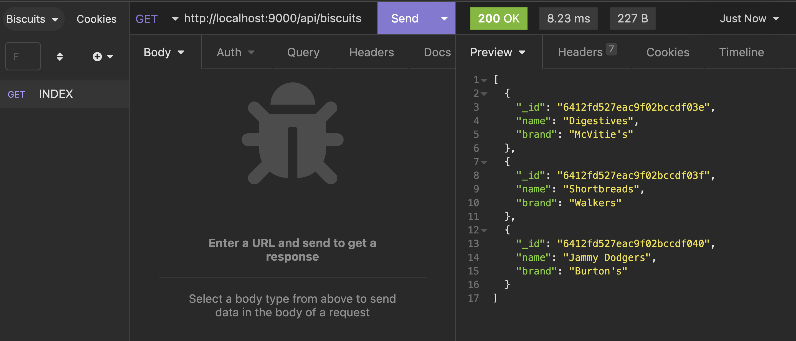
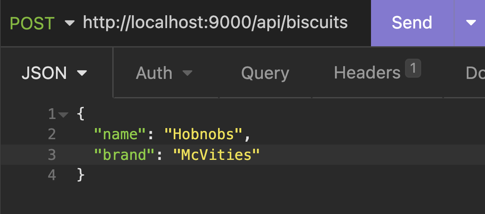
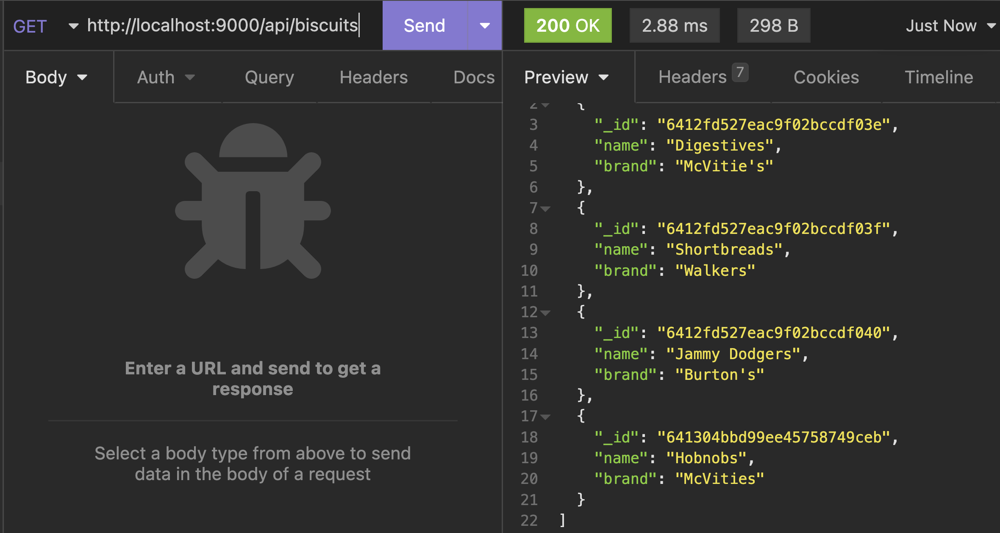
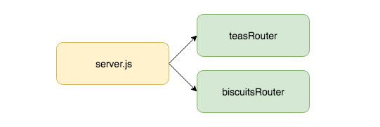

# RESTful API in Express

**Lesson Duration: 120 minutes**

### Learning Objectives
- Be able to create a RESTful JSON API with multiple resources
- Be able to use middleware to handle post request bodies in a RESTful JSON API
- Be able to use Express Router to implement modular routers

## Introduction

A RESTful API defines a set of methods (GET, POST, PUT and DELETE) which developers can use to make requests and receive responses using HTTP protocol. We have been consuming data in a couple of ways. We have hit an API other developers have built and we have hard coded into our front-end JavaScript. But what if we needed our data to come from the server, i.e. if we were fetvhing from a database. In this lesson we are going to start build our own JSON API using an Express server. We will be defining a set of endpoints that handle requests and respond with JSON data, using API design principles to ensure that our service is easy and intuitive for other developers to use.

## RESTful API

When creating an API we want to design it in a way that ensures it is intuitive for other developers to use. To do this we are going to adhere to the following principles:

1. Use the HTTP verbs (GET, POST, PUT and DELETE) appropriately. GET is considered a safe method and shouldn't modify any data. We will only be fociusing on GET and POST in theis course.

2. Create endpoints that use the hierarchical nature of the URL to represent the structure of the request. For example, 'https://codeclan.com/students/' should indicate a request regarding students from the collection 'students'. Collections should be named with the pluralised resource name.

Our API will have one resources, biscuits.


## Responding with JSON

Our JSON data will be an array of biscuit objects with the following details:

```js
const singleBiscuit = {
  name: "Hobnob",
  brand: "McVities"
};
```


## Biscuits Application

The application has an Express server and a Public folder for some visuals. We will focus on the server for now. Run the start code by running the server:

```sh
npm install
npm run server:dev
```

Visit http://localhost:9000/ in the browser.


### biscuits and Biscuits API

The front-end application in the public folder makes an initial request to the following URL and displays a list for the data it gets back:

1. http://localhost:9000/api/biscuits

In this lesson we are going to be working entirely server-side to create a RESTful API for this front-end to consume.

## Creating a RESTful API using an Express Server

We are going to start by creating the biscuit resource, adhering to API design principles to create the following endpoints with the corresponding actions:

- `/api/biscuits` - Index (GET)
- `/api/biscuits` - Create (POST)


> We are using `/api` in the routes to distinguish it from our front-end application. This way, if we wanted a second URL, http://localhost:9000/biscuits, that served HTML, it wouldn't conflict with the API.

Each of these routes will respond with JSON data that our front-end application will consume.

### Index

The start code has an array of biscuits defined in server.js. Later in the module we will be building API's with data persisted to a database, but as the focus of this lesson is serving up the JSON data on a set of RESTful routes, we are using hardcoded data.

Let's start by handling a GET request to the index (`/`). We will use Express's `get` method, passing it the path and a callback that will invoked when a request hits this route, and is passed a request (`req`) and response (`res`) object. We will then send back the `biscuits` array as JSON using the response object's `json` method.

```js
// server.js

const biscuits = [
  //...
];

app.get('/api/biscuits', (req, res) => { // NEW
  res.json(biscuits);
});
```

Now when we visit http://localhost:9000/api/tebiscuitsas in the browser, we see the JSON biscuit data displaying. We have just made the first endpoint of our API.

### Insomnia

When we are building an API, we want a way of testing the endpoints as we create them. We can test the GET methods (index) in the browser, but we need a way of testing the other HTTP methods such as POST (create) without having to build a front-end with a form to send the data. [Insomnia REST Client](https://insomnia.rest/) is a HTTP client that provides us with an convenient way to test our server with all the HTTP methods without requiring a browser front-end.

We are going to use Insomnia REST Client to the index route we have just created.

1. Open Insomnia REST Client.
2. Click the `+` symbol in the left menu (or use `cmd` + `N`) to create a new request.
3. Enter a name ('Index') and select the method ('GET') for the request. Click 'Create'.
4. Add the URL (http://localhost:9000/api/biscuits) in the address bar at the top.
5. Click 'Send' to see the response data display in the right-pane.



*GET request to 'http://localhost:9000/api/biscuits' displaying the response using Insomnia REST Client*


### Create

To be able to handle a POST request, we have to learn about the request's body object. When the client makes a POST request it can send data with the body of the request (for example, the values of a form when it is submitted), which we can then retrieve server-side.

In our case we want the client to be able to send a biscuit object with the request, and for our POST route to then add that object to the `biscuits` array. Our POST route is going to expect to receive an object with a `name` and `brand`.

```js
{
  "name": "One Cup",
  "brand": "Tetley"
}
```

We will use Express's `post` method, pass it the appropriate path, '/api/biscuits' and a callback. To access the data sent from the client with the request, we access the request's `body` object.

```js
// server.js

app.get('/api/biscuits/:id', (req, res) => {
  res.json(biscuits[req.params.id]);
});

app.post('/api/biscuits', (req, res) => { // NEW
  console.log(`req.body`, req.body);
});
```

Test our create route in insomnia:

1. Click the `+` symbol in the left menu (or use `cmd` + `N`) to create a new request.
2. Enter a name ('Create') and select the method ('POST') for the request. Click 'Create'.
3. Add the URL (http://localhost:9000/api/biscuits) in the address bar at the top.
4. This time we need to add the data we want to send with the request. Click 'Body', select 'JSON' and the add the following JSON to the left-hand pane.

```js
{
  "name": "Hobnobs",
  "brand": "McVities"
}
```



*Adding the JSON body to a POST request in Insomnia Rest Client*

> Note: The keys must be enclosed with inverted commas because this is JSON (not JavaScript)

When we click send and look in the Terminal window where the server is running, we see `req.body` is undefined -

```bash
req.body undefined
```

To fix this error we need to use the Express `json()` middleware function, whose purpose is to parse incoming requests with JSON payloads. We can see here that the `body`, which we are trying to access on the request object, is undefined. Express is a light-weight framework and it doesn't expose the body object with its out-of-the-box functionality. To access the request's body, this Express `json()` function helps us extract it from the POST request and make it accessible on `req.body`.

```js
//server.js

app.use(cors());
app.use(express.json()); // NEW
```

`express.json()` provides the middleware that parses json, so our API will only parse the body of a request which has a header with 'Content-Type' specified as JSON. If you click on the 'Header' tab of the left hand section of Insomnia, you will see that there has been a header set with 'Content-Type' set to 'application/json'. Insonmia does this for us when we add a JSON body to the request.

Now when we test our create route, Insomnia Rest Client will hang because we haven't told it what to do in response to the request, but if you look in the terminal window where the server is running, you will see the data outputted: `{ name: 'Hobnobs', brand: 'McVities' }`.

To complete the request, let's push the posted data into the array of biscuits and send back the updated array.

```js
app.post('/api/biscuits/', (req, res) => {
  biscuits.push(req.body);
  res.json(biscuits);
});
```

Now when we test the POST request in Insomnia REST Client, you should get a response of Created.

If you try the Index Route again you should see the new biscuit in the result.



*POST request to 'http://localhost:9000/api/biscuits' displaying the response using Insomnia REST Client*

Our create route is now complete.

### Task: Destroy (15 minutes)


1. Destroy:
  - handle a `delete` request made to `/api/biscuits/:id`
  - delete the appropriate biscuit object in the array
  - send back all the biscuits data as JSON


Test the route with Insomnia

<details>
<summary>Example solution</summary>

```js
// server.js

// ...

app.delete('/api/biscuits/:id', (req, res) => {
  biscuits.splice(req.params.id, 1);
  res.json(biscuits);
});

```

</details>

We now have the Create, Read and Delete operations for our biscuits resource.

## Express Router

If we now want to add the second resource (teas to go with our biscuits possibly) with all the corresponding routes, our server.js is going to get pretty unmanageable and not very DRY. As additional resources get added, the file will get increasingly difficult to maintain. Express provides a Router object which allows us to modularise our sets of routes, specifying a particular path ('/api/biscuits' and '/api/biscuits') for each router.

We are going to refactor our back-end to implement modular routers and generalise the routes for our biscuits resource so that they could be used with any resource. The server will delegate the routing for each resource (biscuits and teas) to its own router. This is what our back-end architecture would look like:



*Server-side architecture with modular routers*

We are going to create a function that:

- takes in the biscuits array
- creates a `Router`
- defines a set of routes on the `Router`
- returns the `Router`

This function is going to be stored in a helper file called `create_router.js`. Let's create a `helpers` directory to store it in and then create the file.

```sh
mkdir server/helpers
touch server/helpers/create_router.js
```

### `createRouter` Function

`createRouter` will be a function that takes in the biscuits array (`data`). It is the function that we will export from the file.

```js
// create_router.js

const createRouter = function (data) {

};

module.exports = createRouter;
```

`createRouter` will create and export an Express `Router`. We will require Express and inside the function invoke `express.Router` which returns a `Router` object.

```js
const express = require('express'); // NEW

const createRouter = function (data) {

  const router = express.Router(); // NEW

};
```

Let's now move the routes handling the biscuits resource requests, from server.js into create_router.js. (Delete it from server.js and add it into create_router.js).

```js
// create_router.js

const express = require('express');

const createRouter = function (data) {

  const router = express.Router();

  app.get('/api/biscuits/', (req, res) => { // NEW
    res.json(biscuits);
  });

  app.get('/api/biscuits/:id', (req, res) => { // NEW
    res.json(biscuits[req.params.id]);
  });

  app.post('/api/biscuits/', (req, res) => { // NEW
    biscuits.push(req.body);
    res.json(biscuits);
  });

  app.delete('/api/biscuits/:id', (req, res) => { // NEW
    biscuits.splice(req.params.id, 1);
    res.json(biscuits);
  });

};

module.exports = createRouter;
```

We need to make a couple of changes the routes we brought in:

1. We need to call the methods on the router object, `router`, rather than `app`
2. We need to change reference to `biscuits` to `data`
2. We need to remove `/api/biscuits` from the paths, as this will be specified by server.js

```js
const express = require('express');

const createRouter = function (data) {

  const router = express.Router();

  router.get('/', (req, res) => { // MODIFIED
    res.json(data); // MODIFIED
  });

  router.get('/:id', (req, res) => { // MODIFIED
    res.json(data[req.params.id]); // MODIFIED
  });

  router.post('/', (req, res) => { // MODIFIED
    data.push(req.body); // MODIFIED
    res.json(data); // MODIFIED
  });

  router.delete('/:id', (req, res) => { // MODIFIED
    data.splice(req.params.id, 1); // MODIFIED
    res.json(data); // MODIFIED
  });

  return router;

};

module.exports = createRouter;

```

That is our biscuits router complete.

### Server

server.js is going to create a `biscuitsRouter` and delegate the routing to it for our biscuits resource. Let's require create_router.js in server.js and create the biscuitsRouter.

```js
// server.js

// ...

const createRouter = require('./helpers/create_router.js'); // NEW

app.use(express.json());

const biscuits = [
  { name: "Digestives", brand: "McVitie's" },
  { name: "Shortbreads", brand: "Walkers" },
  { name: "Jammy Dodgers", brand: "Burton's" },
  { name: "Custard Creams", brand: "Crawford's" }
];

const biscuitsRouter = createRouter(biscuits); //NEW

// ...

```

Now we need to tell the server to use the biscuitsRouter by using the `use` method. The `use` method takes two arguments:

1. the path that we want it to use the biscuits router on, (this is why we removed `/api/biscuits` from the biscuits router routes), meaning we only have to state it here in server.js once.
2. The router object we want it to use

```js
// ...

const biscuitsRouter = createRouter(biscuits);
app.use('/api/biscuits', biscuitsRouter); //NEW

// ...

```

Now we are set up nicely for when we want to add additional resources, as we will be able to create additional modular routers for each resource and require and add them here.

Great, now you can test your API in Insomnia Rest Client again to ensure it is still serving the JSON on the endpoints and visit http://localhost:3000/ to ensure the index.html is still being served up on the home route.


Because the front-end is set up to consume the API on these routes, if you visit 'http://localhost:3000/' you are now able to use the form to submit a biscuit and see it render to the screen.

### Task (15 minutes)

Take note of how the front-end application handles the submission of the form when a new biscuit is added, from the point the form is submitted, to the updated list being rendered on the screen.

<details>
<summary>Example solution</summary>


1. When the application loads, data is fetched from the biscuits API. This data is looped over and the list is created.

2. When the form is submitted, `handleSubmit` creates an object using the submitted values and sends a fetch request to `/api/biscuits` with this object. 

3. The fetch carries out a `POST` request, passing the object as a second optional argument, that specifies three properties:
- the method - POST
- the body - the object created from the submitted values
- the data type being sent - JSON

3. A `fetch` request is sent with the body as JSON (just as in Insomnia), the method set to `POST`, and the `Content-Type` set to "application/json". Each of these steps is necessary.

4. When the server responds, we use the `getBiscuits` to refresh the data.
The form is then cleared.

</details>

## Recap

What design principles should we consider when creating and API? And why?

<details>
<summary>Answer</summary>

We should use the appropriate HTTP methods and create endpoints that use hierarchical nature of the URL to represent the structure of the request, so that it is easy and intuitive to use.

</details>

What is the purpose of the the middleware `express.json()` function?

<details>
<summary>Answer</summary>

The role of the `express.json()` function is to parse incoming requests with JSON payloads, thus making the request body object accessible on `req.body`.

</details>

What problem does the Express Router object solve?

<details>
<summary>Answer</summary>

It prevents all our routes for multiple resources having to be in the same file. It also allows us to create modularised routers.

</details>

## Conclusion

Creating RESTful APIs allows us to create a back-end service that our front-end application can consume. Adhering to RESTful API design principles we can ensure our APIs are easy and intuitive for other developers to use.

Because Express is a light-weight framework, we have to use the additional middleware, body-parse, to handle POST requests and retrieve the data sent on the body of the request.

Using Express Router we can create modularised routes for each of the API's resources, creating a server-side application which is maintainable and extensible.
